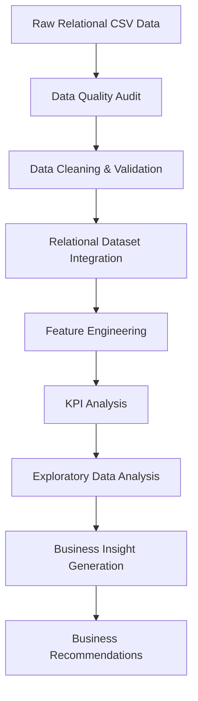
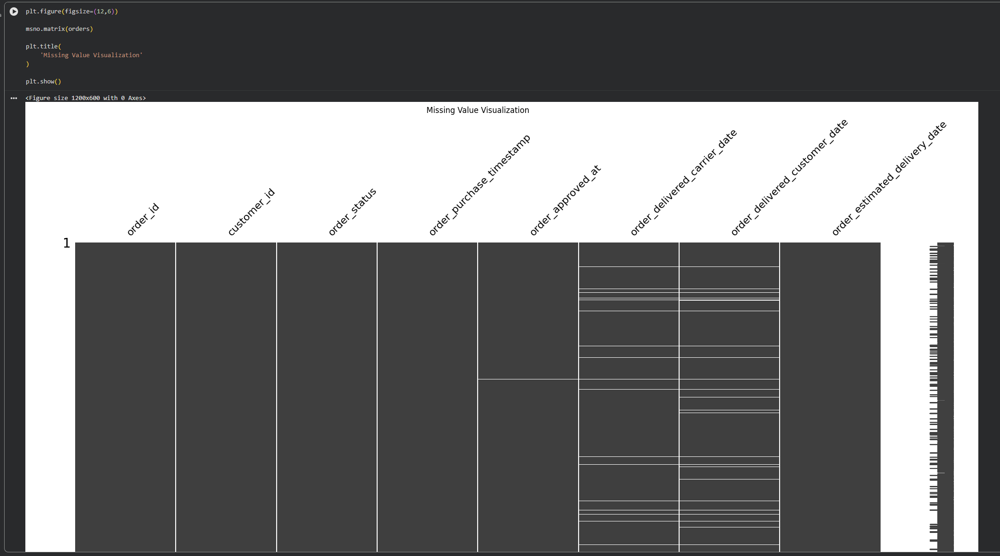
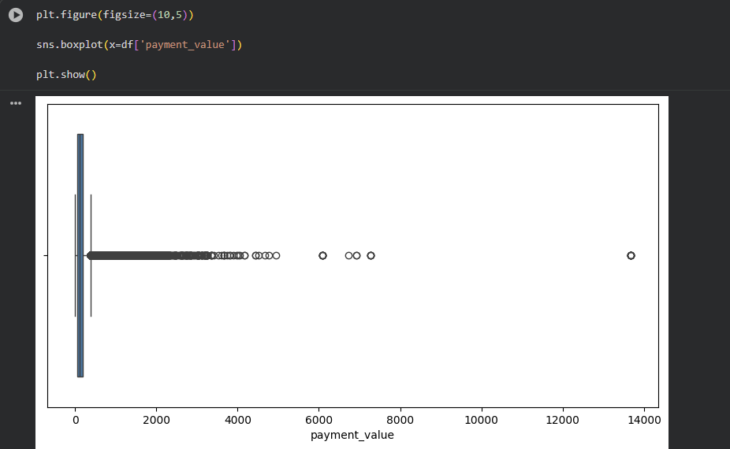
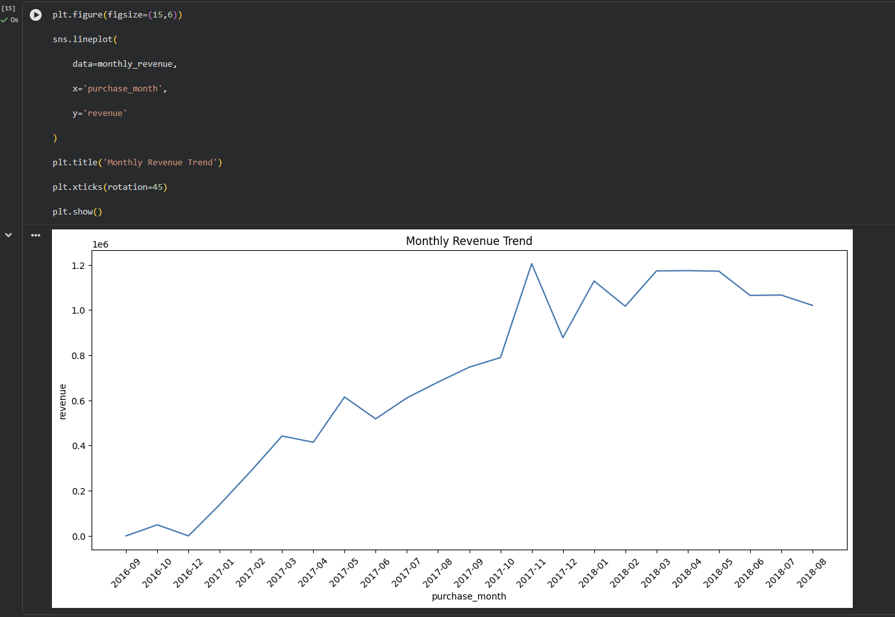
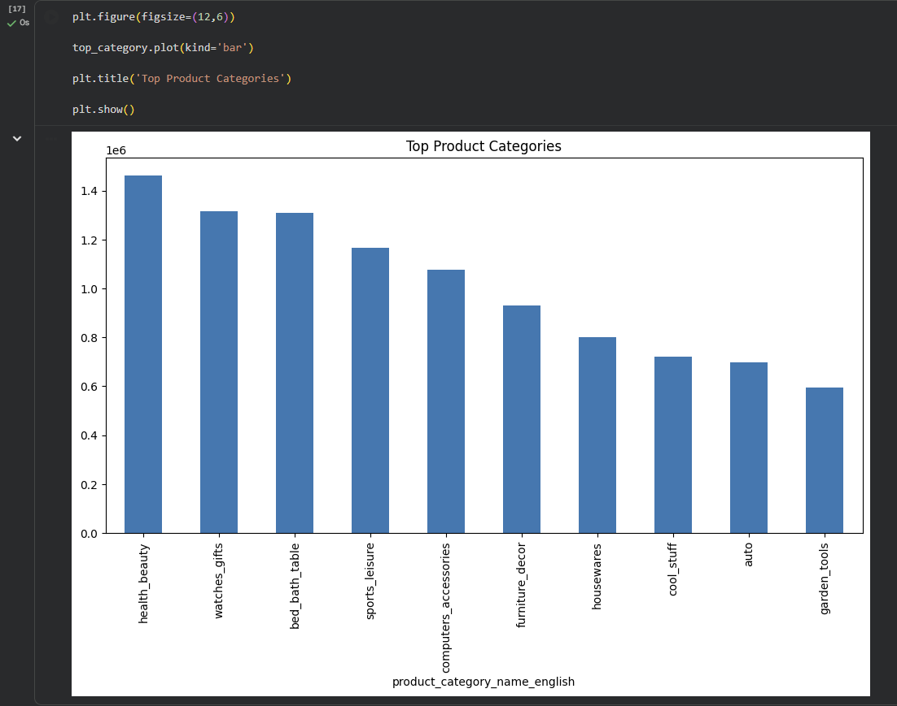
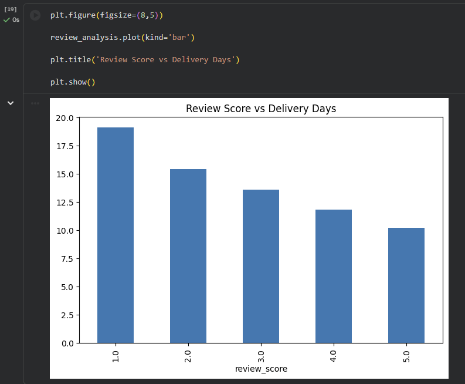
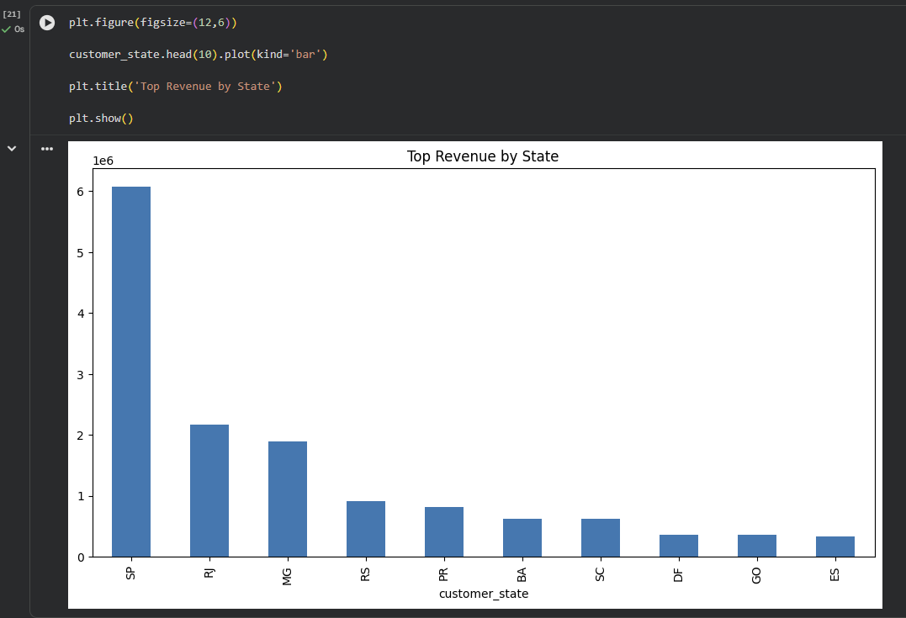

# E-Commerce Business Performance Analytics

> End-to-end business analytics project focused on uncovering revenue trends, customer behavior, delivery performance, and operational insights from real-world e-commerce transactional data.

---

# Executive Summary

This project analyzes the Brazilian E-Commerce Public Dataset by Olist to simulate a real-world analytics workflow commonly performed by:

* Data Analysts
* Business Intelligence Analysts
* E-Commerce Strategy Teams

The project transforms raw transactional datasets into actionable business insights through:

* data wrangling,
* exploratory data analysis (EDA),
* feature engineering,
* KPI analysis,
* and business-oriented recommendations.

The primary objective is to understand how operational performance, customer behavior, and logistics efficiency influence overall business performance.

---

# Business Problem

Modern e-commerce companies generate massive volumes of transactional and operational data every day.

However, without proper analytics, businesses struggle to:

* identify operational bottlenecks,
* monitor delivery efficiency,
* understand customer purchasing behavior,
* evaluate customer satisfaction,
* and optimize revenue performance.

This project aims to answer several high-impact business questions:

* Which product categories contribute the most revenue?
* How does delivery performance affect customer review scores?
* Which geographic regions generate the highest business value?
* What operational issues negatively impact customer experience?
* How can analytics support strategic business decisions?

Understanding these patterns is essential for:

* improving customer retention,
* optimizing logistics operations,
* increasing operational efficiency,
* and driving sustainable business growth.

---

# Why This Project Matters

For e-commerce businesses, customer satisfaction and operational efficiency are strongly interconnected.

Even small delays in delivery performance can significantly affect:

* customer reviews,
* repeat purchases,
* customer loyalty,
* and long-term business growth.

This project demonstrates how business analytics can help organizations:

* identify hidden operational inefficiencies,
* monitor business KPIs,
* improve customer experience,
* and support data-driven strategic planning.

The workflow used in this project reflects practical analytics tasks commonly found in:

* e-commerce companies,
* consulting firms,
* and business intelligence teams.

---

# Dataset

Dataset Used:

* Olist Brazilian E-Commerce Public Dataset

Dataset Source:

* https://www.kaggle.com/datasets/olistbr/brazilian-ecommerce

The dataset contains:

* customer information,
* orders,
* products,
* payments,
* sellers,
* reviews,
* and logistics data.

The dataset structure closely resembles real-world relational business databases, making it highly suitable for analytics and business intelligence projects.

---

# Analytical Approach

The project follows a structured end-to-end analytics workflow:

1. Data Quality Assessment
2. Data Cleaning & Validation
3. Relational Dataset Integration
4. Feature Engineering
5. KPI Analysis
6. Exploratory Data Analysis
7. Business Insight Generation
8. Business Recommendation Development

The analysis prioritizes:

* business interpretation,
* operational understanding,
* and actionable insights,
  rather than purely technical outputs.

---

# Workflow Architecture



---

# Tech Stack

## Programming & Analytics

* Python
* Pandas
* NumPy

## Data Visualization

* Matplotlib
* Seaborn
* Missingno

## Data Processing

* Data Cleaning
* Missing Value Handling
* Relational Dataset Merge
* Feature Engineering
* Outlier Detection (IQR)

## Analytical Techniques

* KPI Analysis
* Trend Analysis
* Correlation Analysis
* Delivery Performance Analysis
* Customer Behavior Analysis

---

# KPI Analysis

The project evaluates several key business KPIs:

| KPI                       | Description                         |
| ------------------------- | ----------------------------------- |
| Total Revenue             | Overall revenue generated           |
| Total Orders              | Number of unique customer orders    |
| Total Customers           | Number of active customers          |
| Average Order Value (AOV) | Average revenue generated per order |
| Late Delivery Rate        | Percentage of delayed deliveries    |

---

# Key Business Findings

## 1. Delivery Performance Strongly Influences Customer Satisfaction

The analysis identified a clear relationship between delivery duration and customer review scores.

Orders with longer delivery times consistently received lower review ratings, highlighting the operational importance of logistics efficiency.

---

## 2. Revenue Growth Shows Strong Seasonal Patterns

Revenue increased significantly during Q4 periods, indicating strong seasonal shopping behavior and potential opportunities for strategic promotional campaigns.

---

## 3. Revenue Contribution Is Highly Concentrated

A relatively small number of product categories contributed disproportionately to total business revenue.

This insight can support:

* inventory prioritization,
* product strategy optimization,
* and marketing budget allocation.

---

## 4. High Revenue Does Not Always Correlate with High Satisfaction

Several high-performing product categories generated strong revenue while simultaneously receiving lower customer review scores.

This may indicate:

* product quality concerns,
* fulfillment inefficiencies,
* or customer expectation mismatches.

---

# Visualization Preview

## Missing Value Analysis

The visualization below was used during the data quality auditing process to identify missing values across critical operational columns.



---

## Payment Value Outlier Detection

Outlier analysis was performed using the IQR method to identify abnormal transaction values and improve analytical consistency.



---

## Monthly Revenue Trend

The analysis identified strong revenue growth trends and seasonal purchasing behavior throughout the observed periods.



---

## Top Product Categories by Revenue

The chart below highlights the highest-performing product categories based on total revenue contribution.



---

## Review Score vs Delivery Performance

The analysis identified a strong inverse relationship between delivery duration and customer review scores.

Longer delivery times were consistently associated with lower customer satisfaction.



---

## Top Revenue by Customer State

Revenue generation was highly concentrated within a small number of geographic regions, particularly São Paulo (SP).



---

# Business Recommendations

## Logistics Optimization

Prioritize operational improvements in regions with consistently high delivery delays.

Reducing shipping delays may significantly improve:

* customer satisfaction,
* review scores,
* and customer retention.

---

## Product Strategy Optimization

Increase marketing investment in high-performing categories with strong revenue contribution and positive customer sentiment.

---

## Customer Retention Strategy

Develop customer retention initiatives and loyalty programs targeting repeat purchasers.

---

## Seller Performance Monitoring

Monitor sellers with:

* poor delivery performance,
* low review scores,
* or inconsistent operational quality.

---

# Business Impact

This project demonstrates how business analytics can help e-commerce organizations:

* improve operational efficiency,
* optimize logistics performance,
* increase customer satisfaction,
* support strategic planning,
* and drive data-informed decision making.

The workflow and analytical approach used in this project closely resemble real-world analytics processes used in modern organizations.

---

# Real-World Scenario

This project simulates a realistic end-to-end analytics workflow commonly performed in:

* E-Commerce Companies
* Business Intelligence Teams
* Data Analytics Departments
* Consulting & Strategy Teams

The project focuses not only on technical implementation, but also on:

* business interpretation,
* operational understanding,
* and strategic recommendation generation.

---

# Results

## Project Outcomes

* Successfully transformed raw relational datasets into business-ready analytical datasets.
* Identified delivery performance as one of the strongest operational drivers of customer satisfaction.
* Discovered seasonal purchasing patterns and concentrated revenue distribution.
* Built a structured end-to-end business analytics workflow using Python.

---

# Project Structure

```text
ecommerce-business-analytics/
│
├── data/
│
├── notebooks/
│   ├── 01_data_wrangling.ipynb
│   ├── 02_business_eda.ipynb
│   └── 03_business_insight.ipynb
│
├── images/
│   ├── missing_value_analysis.png
│   ├── payment_outlier_analysis.png
│   ├── revenue_trend.png
│   ├── top_product_categories.png
│   ├── review_vs_delivery.png
│   └── revenue_by_state.png
│
├── README.md
│
└── requirements.txt
```

---

# How To Run

## 1. Clone Repository

```bash
git clone https://github.com/NzxCode/ecommerce-business-analytics.git
```

---

## 2. Install Dependencies

```bash
pip install -r requirements.txt
```

---

## 3. Run Jupyter Notebook

Open and run:

* 01_data_wrangling.ipynb
* 02_business_eda.ipynb
* 03_business_insight.ipynb

---

# Future Improvements

Potential future enhancements include:

* Customer Segmentation (RFM Analysis)
* Sales Forecasting
* Interactive Dashboard Development
* SQL Data Warehouse Integration
* Automated Reporting Pipeline
* Business Intelligence Dashboard Integration

---

# What I Learned

Through this project, I learned:

* real-world data wrangling workflows,
* relational dataset integration,
* KPI-driven analytics,
* business-oriented exploratory analysis,
* operational insight generation,
* data storytelling,
* and translating analytical findings into actionable business recommendations.

---

# Author

## Nicolas Gabriel Kurnadi

### GitHub

https://github.com/NzxCode

### LinkedIn

https://www.linkedin.com/in/nicolasgabrielkurnadi/
